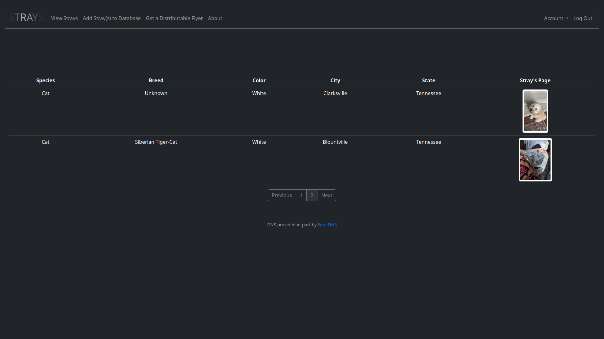
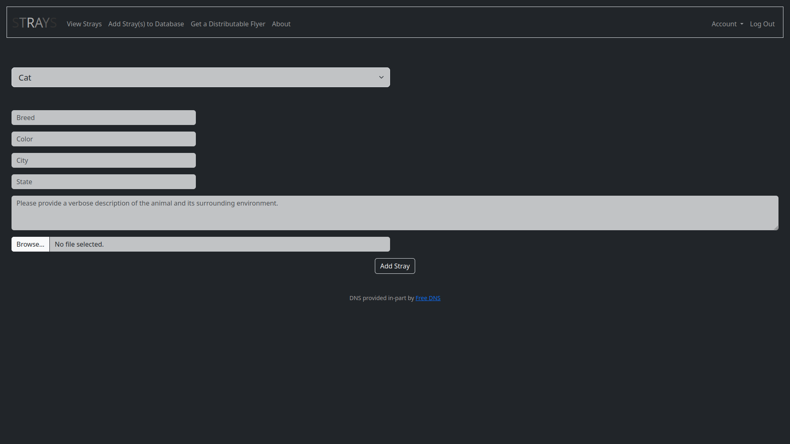
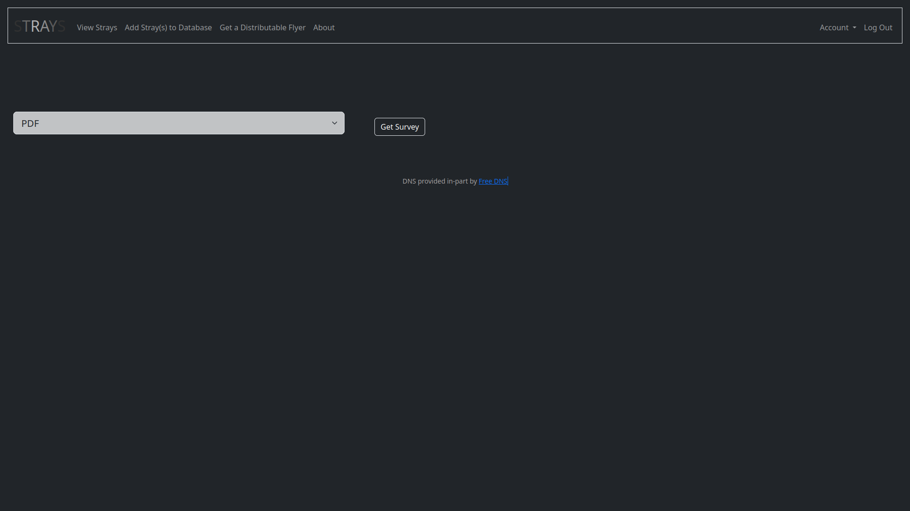
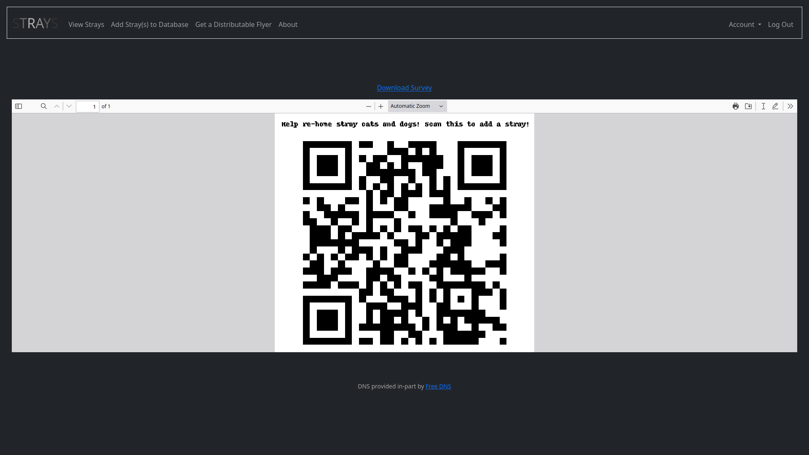
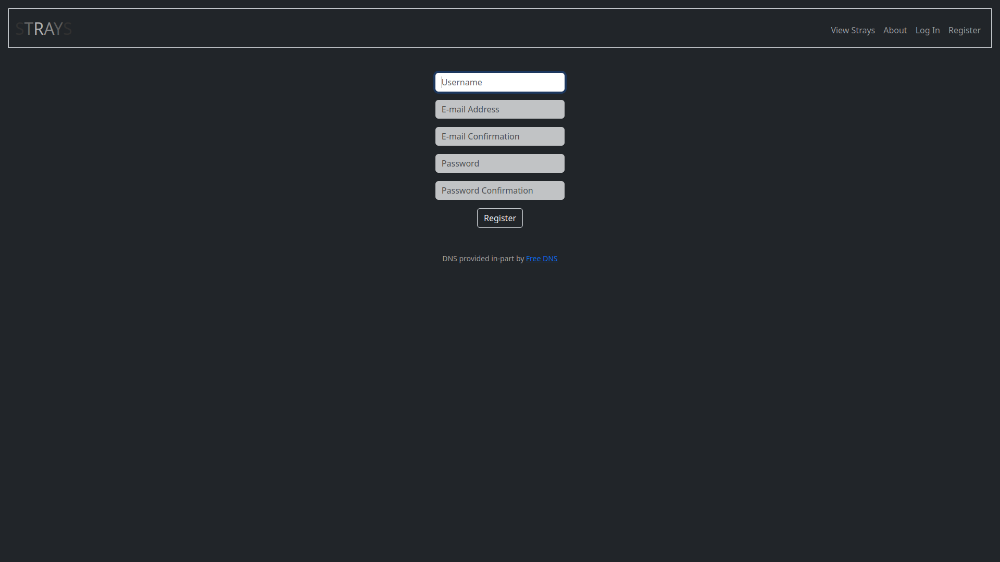
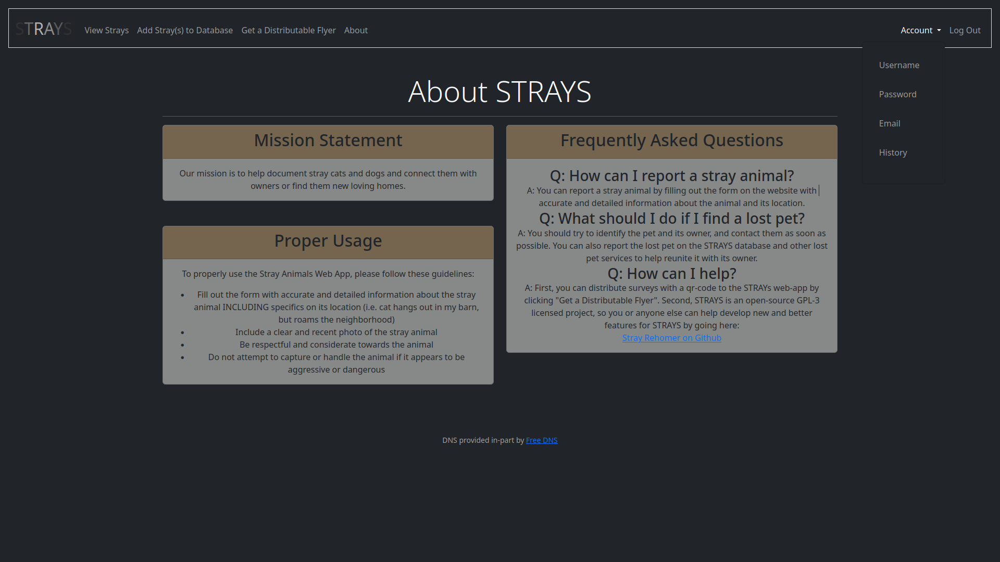

# Stray-Rehomer
Stray Rehomer is a web-app written in python using sqlite3 for the database. The front-end and routing are handled by flask and the jinja templating language. The project utilizes google's Gmail API for sending account verification emails. 

If you'd like to host an instance of STRAYS, you'll need to configure a working project on the google console and further configure an email address and oauth credentials for use in running the application.

Final Project for CS50: https://www.edx.org/course/introduction-computer-science-harvardx-cs50x

The main application file is rehomr.py which contains all the blueprint views for the web-app and most of the logic for the application. The second application file is auth.py which contains helper functions for authenticating email addresses, getting file paths, generating qr-codes, and contains the login_required() function for certain views. The third is config.py which contains configuration information for the app including credentials for interacting with the gmail API. __init__.py and db.py contain applications for initializing the database if it doesn't exist, and getting the database/configuring it for use with the application if it exists. Schema.sql contains the sqlite3 db schema. The static directory contains /uploads with /thumbnails there-in to hold all user-submitted images and thumbnails, this directory also contains generated qr_codes which are generated and served live rather than stored permanently.
The templates directory contains all the .html templates used in the web-application accessed by jinja and flask. Requirements.txt contains all the dependencies which the program needs to run, and the python version used for development is 3.10.10.

